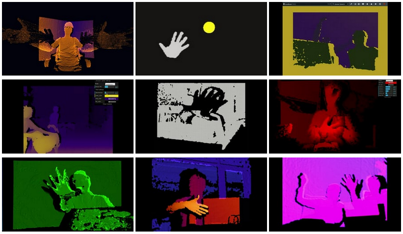
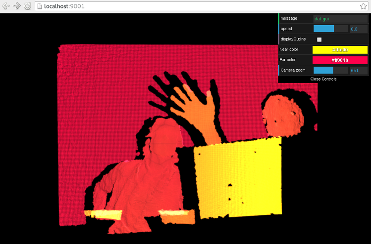

Make a Kimotion!
================

A spiffy, new, ultra customizable visualization renderer for interactive art
exhibits.

What's so new?
--------------

In 2014, contributing a visualization to the Digital Motion exhibit involved
building a JavaScript-based web renderer from the ground up.  The only shared
code was some re-pasted WebSockets boilerplate.

Kimotion standardizes on a single renderer, with a streamlined approach for
contributing special mods.

Installation
------------

First, install [Node.js][node].  It should come with the npm package manager,
which you can use to install the rest of the dependencies.  If your platform's
Node.js package doesn't include npm, install it separately.  On Fedora, you can
run `yum install npm`.

Then clone this repo, cd into it and...

    npm install -g bower grunt-cli
    npm install && bower install
    grunt watch

Then, in another terminal...

    grunt connect

Open [http://localhost:9001](http://localhost:9001) in your browser, and...

You won't see much, because you need to connect the renderer to the [input
server][server] (which itself is connected to a Kinect).  If you do have
that server running, put in its hostname or IP address and port, and you'll see
something like this!

Last years' Exhibit
-------------------

 - [DiMo 2014][dimo2014]

[dimo2014]: http://palebluepixel.org/projects/dimo/
[server]: /server
[node]: https://nodejs.org/
